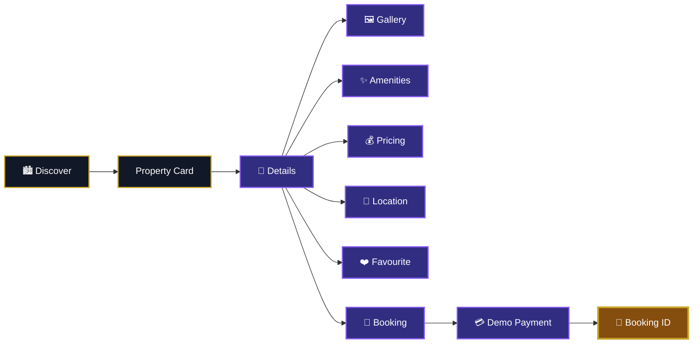
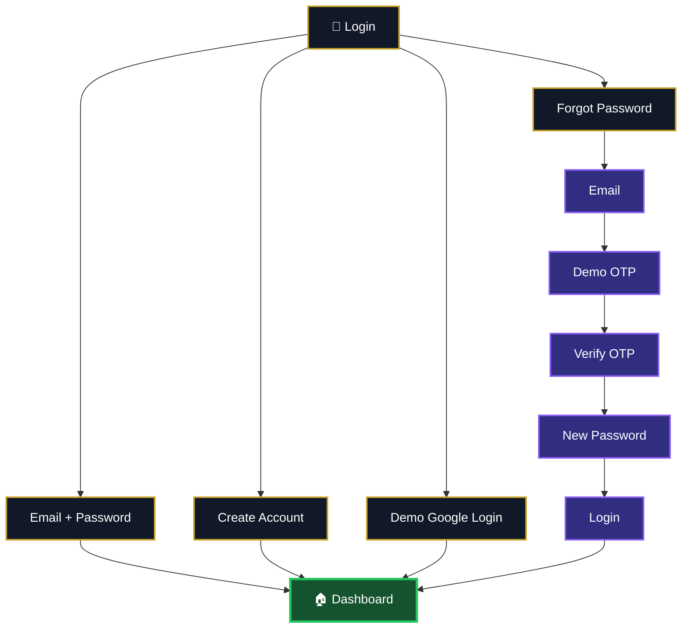
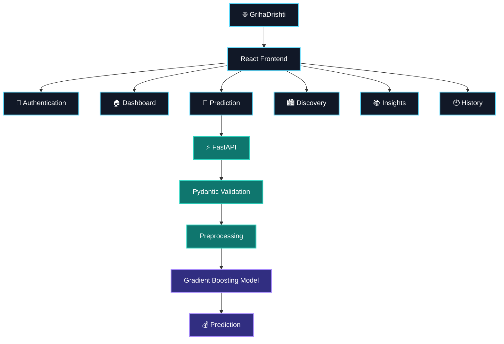

<div align="center">


<br>

# 🏡 GrihaDrishti

### **See the home. Understand its value.**


<br><br>


<br><br>


</div>

---

## ✦ About GrihaDrishti

**GrihaDrishti** is an AI-powered house price intelligence platform that combines machine learning, property discovery, property insights, prediction history and a premium cinematic interface into one modern real-estate experience.

The name comes from:

**Griha** — Home  
**Drishti** — Perspective

GrihaDrishti represents a smarter perspective toward understanding a home's characteristics and estimated value.

---

## ✦ Complete User Experience

```mermaid
flowchart LR
    A["🏡 Splash"] --> B["🔐 Login"]
    B --> C["🏠 Dashboard"]
    C --> D["🤖 AI Prediction"]
    D --> E["⚙️ AI Analysis"]
    E --> F["💰 Prediction Result"]
    F --> G["🕘 History"]

    C --> H["🏙️ Property Discovery"]
    H --> I["🏡 Property Details"]
    I --> J["📅 Demo Booking"]

    C --> K["📚 Market Insights"]

    classDef primary fill:#111827,stroke:#C9A227,color:#fff,stroke-width:2px;
    classDef secondary fill:#312E81,stroke:#8B5CF6,color:#fff,stroke-width:2px;
    classDef result fill:#854D0E,stroke:#C9A227,color:#fff,stroke-width:3px;

    class A,B,C primary;
    class D,E,H,I,K secondary;
    class F,G,J result;
````

---

## ✦ Core Features

### 🎬 Premium Cinematic Splash Screen

The application begins with a cinematic property-intelligence experience featuring architectural visuals, animated loading, spatial HUD elements, premium typography, technical interface details and responsive desktop/mobile compositions.

### 🔐 Authentication

The frontend includes a complete demonstration authentication flow:

* Email login
* Signup
* Password visibility
* Password validation
* Forgot password
* Demo OTP generation
* OTP verification
* Password reset
* Demo Google login
* Logout
* Local session persistence

### 🏠 Intelligent Dashboard

The dashboard provides a central control surface for the application with:

* Personalized welcome
* AI property valuation
* Property discovery
* Prediction history
* Market insights
* Recent predictions
* Quick actions
* Responsive navigation
* User information

### 🤖 AI Property Valuation

Users can enter detailed property information and receive an estimated property value from the trained machine-learning model.

The prediction system processes **79 property features**.

### ⚙️ AI Analysis Animation

After submitting property information, GrihaDrishti provides an animated AI processing experience representing:

* Property data processing
* Property context analysis
* Market pattern analysis
* AI valuation processing
* Final valuation preparation

### 💰 Prediction Result

The prediction result screen displays the model-generated estimated SalePrice along with the submitted property information and the ability to recalculate.

### 🕘 Prediction History

Successful predictions can be stored locally.

Users can:

* View predictions
* Review property information
* Delete individual predictions
* Clear all history
* Export prediction history as CSV
* Start a new prediction

### 🏙️ Property Discovery

The property discovery module provides:

* Property cards
* Property images
* Location
* BHK
* Area
* Sale price
* Price per sq.ft.
* Amenities
* Property status
* Demo availability
* Favourites
* Property details
* Gallery
* Demo booking
* Demo payment
* Booking confirmation
* Booking ID
* My Bookings

### 📚 Market Insights

Market Insights explains the complete set of prediction inputs in customer-friendly language.

Every feature explains:

* What it is
* What the user should enter
* Example input
* Why it matters for property value

### 📊 CSV Export

Prediction history can be exported into CSV format for offline review.

---

## ✦ AI Valuation Engine

```mermaid
flowchart TD
    A["🏠 Property Input"] --> B["Validation"]
    B --> C["Feature Preparation"]
    C --> D["Numeric Processing"]
    C --> E["Categorical Processing"]
    D --> F["Gradient Boosting"]
    E --> F
    F --> G["log1p(SalePrice)"]
    G --> H["Model Prediction"]
    H --> I["expm1()"]
    I --> J["💰 Estimated SalePrice"]

    classDef input fill:#0F172A,stroke:#C9A227,color:#fff,stroke-width:2px;
    classDef process fill:#1E1B4B,stroke:#8B5CF6,color:#fff,stroke-width:2px;
    classDef output fill:#854D0E,stroke:#C9A227,color:#fff,stroke-width:3px;

    class A input;
    class B,C,D,E,F,G,H,I process;
    class J output;
```

---

## ✦ Machine Learning Model

The current valuation engine uses a **Gradient Boosting Regressor** trained on the Ames / House Prices dataset.

### Model Configuration

| Parameter             |                     Value |
| --------------------- | ------------------------: |
| Algorithm             | GradientBoostingRegressor |
| Estimators            |                      1000 |
| Learning Rate         |                      0.05 |
| Maximum Depth         |                         3 |
| Minimum Samples Split |                         4 |
| Minimum Samples Leaf  |                         2 |
| Loss                  |                     Huber |
| Target                |                 SalePrice |
| Training Target       |        `log1p(SalePrice)` |
| Prediction            |     `expm1(model_output)` |

### Validation Results

| Metric       |     Result |
| ------------ | ---------: |
| Average MAE  | $14,971.52 |
| Average RMSE | $27,996.37 |
| Average R²   |     0.8596 |
| Within ±5%   |     46.37% |
| Within ±10%  |     73.70% |
| Within ±20%  |     92.33% |

> R² is a statistical evaluation metric and should not be interpreted as an accuracy percentage.

---

## ✦ 79 Property Intelligence Features

GrihaDrishti uses 79 model input features.

<details>
<summary><b>🏠 Property Basics</b></summary>

Building Class, Zoning, Lot Frontage, Lot Area, Street, Alley, Lot Shape, Land Contour, Utilities, Lot Configuration, Land Slope, Neighborhood, Condition 1, Condition 2, Building Type and House Style.

</details>

<details>
<summary><b>⭐ Quality & Construction</b></summary>

Overall Quality, Overall Condition, Year Built, Year Remodeled, Roof Style, Roof Material, Exterior 1, Exterior 2, Masonry Type, Masonry Area, Exterior Quality, Exterior Condition and Foundation.

</details>

<details>
<summary><b>🧱 Basement</b></summary>

Basement Quality, Basement Condition, Basement Exposure, Basement Finish Type 1, Basement Finished Area 1, Basement Finish Type 2, Basement Finished Area 2, Basement Unfinished Area, Total Basement Area, Basement Full Bath and Basement Half Bath.

</details>

<details>
<summary><b>🛋️ Utilities & Interior</b></summary>

Heating, Heating Quality, Central Air, Electrical, First Floor Area, Second Floor Area, Low Quality Finished Area, Above Ground Living Area, Full Bath, Half Bath, Bedrooms Above Ground, Kitchens Above Ground, Kitchen Quality, Total Rooms Above Ground and Functional Condition.

</details>

<details>
<summary><b>🔥 Fireplace & Garage</b></summary>

Fireplaces, Fireplace Quality, Garage Type, Garage Year Built, Garage Finish, Garage Cars, Garage Area, Garage Quality, Garage Condition and Paved Driveway.

</details>

<details>
<summary><b>🌳 Outdoor Features</b></summary>

Wood Deck Area, Open Porch Area, Enclosed Porch Area, Three Season Porch, Screen Porch, Pool Area, Pool Quality, Fence, Miscellaneous Feature and Miscellaneous Value.

</details>

<details>
<summary><b>📅 Sale Information</b></summary>

Month Sold, Year Sold, Sale Type and Sale Condition.

</details>

---

## ✦ Market Insights

Market Insights transforms technical model features into simple property information.

For every feature, users can understand:

**What is this?**

**What should I enter?**

**Example**

**Why does it matter?**

This allows customers to understand the prediction form without needing machine-learning knowledge.

---

## ✦ Property Discovery



The discovery experience includes demo properties with:

* Images
* Location
* BHK
* Area
* Price
* Price per sq.ft.
* Amenities
* Availability
* Property details
* Gallery
* Favourites
* Demo booking
* Demo payment
* Booking confirmation
* Booking ID
* My Bookings

> Availability and payment are demonstration features and do not represent real-time transactions.

---

## ✦ Prediction History

Prediction history is stored locally in the browser.

Each saved prediction can contain:

* Prediction date
* Sale price
* Currency
* Overall quality
* Overall condition
* Living area
* Bedrooms
* Bathrooms
* Year built
* Year remodeled
* Neighborhood
* Lot area
* Garage cars
* Garage area
* Basement area
* First floor area
* Second floor area

Available actions:

* View
* Delete
* Clear all
* Export CSV
* New prediction

---

## ✦ Authentication Flow



The authentication system is intentionally frontend-only and uses browser local storage.

It is designed for demonstration and prototype purposes rather than production security.

---

## ✦ Premium UI

GrihaDrishti follows a cinematic architecture-inspired design language.

The interface combines:

* Dark premium surfaces
* Architectural imagery
* Gold highlights
* Glass-style cards
* Spatial HUD elements
* Animated interfaces
* Smooth transitions
* Responsive layouts
* Modern typography
* AI-inspired visual effects

---

## ✦ Technology Stack

### Frontend

* React
* Vite
* Tailwind CSS
* Framer Motion
* GSAP
* Lucide React
* JavaScript

### Backend

* Python
* FastAPI
* Pydantic
* Pandas
* NumPy
* Joblib

### Machine Learning

* Scikit-learn
* Gradient Boosting Regressor
* One-Hot Encoding
* Median Imputation
* Log-target transformation

---

## ✦ System Architecture



---

## ✦ Project Structure

```text
GrihaDrishti/
├── public/
├── src/
│   ├── assets/
│   ├── components/
│   │   ├── AnalysisPage.jsx
│   │   ├── ForgotPassword.jsx
│   │   ├── HomePage.jsx
│   │   ├── LoginPage.jsx
│   │   ├── MarketInsights.jsx
│   │   ├── PredictionHistory.jsx
│   │   ├── PredictionPage.jsx
│   │   ├── PredictionResult.jsx
│   │   ├── PropertyDiscovery.jsx
│   │   ├── SignupPage.jsx
│   │   └── SplashScreen.jsx
│   ├── utils/
│   │   ├── api.js
│   │   └── demoAuth.js
│   ├── App.jsx
│   ├── App.css
│   ├── index.css
│   └── main.jsx
├── backend/
│   ├── app/
│   ├── data/
│   ├── models/
│   └── training/
├── package.json
├── package-lock.json
├── vite.config.js
└── README.md
```

---

## ✦ Installation

### Clone

```bash
git clone https://github.com/Arijit07-tech7/GrihaDrishti.git
cd GrihaDrishti
```

### Frontend

```bash
npm install
npm run dev
```

Frontend:

```text
http://localhost:5173
```

### Backend

```bash
cd backend
python -m venv .venv
```

Windows:

```powershell
.\.venv\Scripts\Activate.ps1
pip install -r requirements.txt
uvicorn app.main:app --reload
```

Backend:

```text
http://127.0.0.1:8000
```

FastAPI documentation:

```text
http://127.0.0.1:8000/docs
```

---

## ✦ API

### Health Check

```http
GET /health
```

### Prediction

```http
POST /predict
```

Example response:

```json
{
  "success": true,
  "prediction": {
    "salePrice": 203611.67,
    "currency": "USD",
    "target": "SalePrice"
  },
  "message": "Property valuation generated successfully."
}
```

---

## ✦ Dataset

The current model uses the **Ames / House Prices dataset**.

The dataset contains historical housing information and the prediction target is `SalePrice`.

The model is therefore a machine-learning demonstration based on historical Ames housing data and should not be interpreted as a live Kolkata or Indian real-estate pricing engine.

The generated value is an estimated model output and is not a guaranteed market price.

---

## ✦ Current Status

| Feature                 | Status |
| ----------------------- | :----: |
| Cinematic Splash Screen |    ✅   |
| Demo Login              |    ✅   |
| Demo Signup             |    ✅   |
| Forgot Password         |    ✅   |
| Demo OTP                |    ✅   |
| Demo Google Login       |    ✅   |
| Dashboard               |    ✅   |
| AI Property Prediction  |    ✅   |
| ML Backend              |    ✅   |
| AI Analysis Animation   |    ✅   |
| Prediction Result       |    ✅   |
| Prediction History      |    ✅   |
| CSV Export              |    ✅   |
| Market Insights         |    ✅   |
| Property Discovery      |    ✅   |
| Property Details        |    ✅   |
| Favourites              |    ✅   |
| Demo Booking            |    ✅   |
| Demo Payment UI         |    ✅   |
| Booking Confirmation    |    ✅   |
| Responsive Design       |    ✅   |

---

## ✦ Roadmap

* India-specific housing datasets
* Location-aware valuation
* Live property information
* Real-time market insights
* Explainable AI
* Advanced recommendations
* Production authentication
* Secure database integration
* Cloud deployment
* More advanced valuation models
* Real-time property intelligence

---

## ✦ Security

The current authentication implementation is a frontend demonstration using browser local storage.

Do not commit:

* API keys
* Passwords
* Private tokens
* Secret credentials
* Sensitive environment variables

Production deployment should use secure authentication, protected backend services and appropriate database security.

---

## ✦ Important Note

GrihaDrishti is currently a property-intelligence prototype designed for educational, demonstration, portfolio and development purposes.

The current valuation engine is trained on historical Ames housing data.

The prediction should therefore be treated as an estimated machine-learning output rather than a professional property appraisal or guaranteed market price.

---

<div align="center">


<br><br>


<br><br>


<br><br>

# ✦ ARIJIT GUPTA ✦

### **GrihaDrishti**

<sub>AI • Property Intelligence • Machine Learning • Modern Web Experience</sub>

</div>
