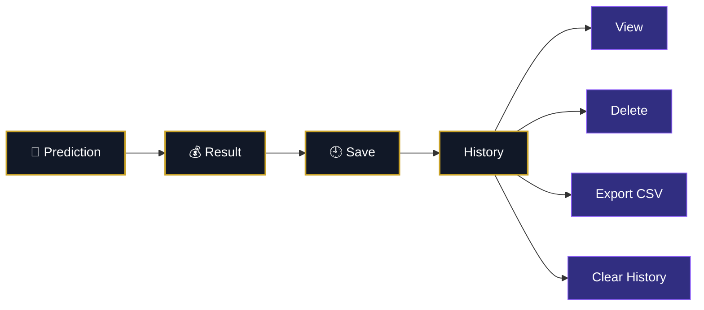
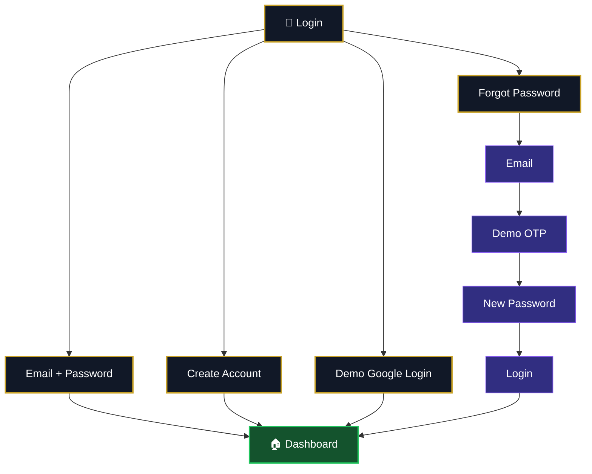
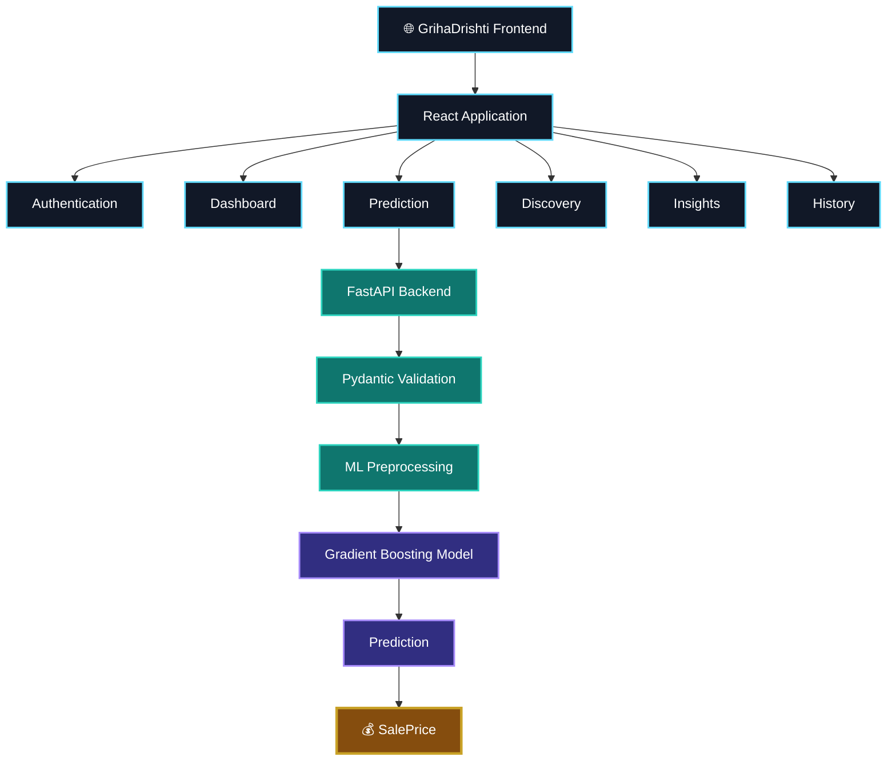

<div align="center">


<br>

# 🏡 GrihaDrishti

### **See the home. Understand its value.**


<br><br>


<br><br>


</div>

---

## ✦ About GrihaDrishti

**GrihaDrishti** is an AI-powered house price intelligence platform that combines machine learning, property discovery, detailed property analysis and a premium cinematic interface into one modern real-estate experience.

The name comes from:

**Griha** — Home  
**Drishti** — Perspective

GrihaDrishti provides a smarter perspective toward understanding a property's characteristics and estimated value.

---

## ✦ Experience

```mermaid
flowchart LR
    A["🏡 Property Data"] --> B["✦ GrihaDrishti"]
    B --> C["🤖 AI Analysis"]
    C --> D["💰 Estimated Value"]
    B --> E["🏙️ Property Discovery"]
    B --> F["📚 Market Insights"]
    B --> G["🕘 Prediction History"]

    classDef main fill:#111827,stroke:#C9A227,color:#fff,stroke-width:2px;
    classDef accent fill:#312E81,stroke:#A78BFA,color:#fff,stroke-width:2px;

    class B,C,D main;
    class A,E,F,G accent;
````

---

## ✦ Core Features

<table>
<tr>
<td width="50%">

### 🤖 AI Property Valuation

Generate an estimated property SalePrice using a trained machine-learning model and 79 property features.

</td>
<td width="50%">

### 🏙️ Property Discovery

Explore demo properties with images, location, BHK, area, pricing, amenities, favourites and details.

</td>
</tr>

<tr>
<td>

### 📚 Market Insights

Understand the 79 model features through simple explanations, examples and property-value context.

</td>
<td>

### 🕘 Prediction History

Store, review, delete and export previous property predictions.

</td>
</tr>

<tr>
<td>

### 🔐 Demo Authentication

Login, signup, password recovery, demo OTP, password reset and demo Google login.

</td>
<td>

### ✦ Premium UI

Cinematic architecture-inspired visuals, glass-style surfaces, motion, responsive layouts and modern SaaS design.

</td>
</tr>
</table>

---

## ✦ AI Property Valuation

```mermaid
flowchart TD
    A["🏠 Property Information"] --> B["Validation"]
    B --> C["Feature Preparation"]
    C --> D["Numeric Processing"]
    C --> E["Categorical Processing"]
    D --> F["Gradient Boosting"]
    E --> F
    F --> G["log1p Target"]
    G --> H["Model Prediction"]
    H --> I["expm1 Transformation"]
    I --> J["💰 Estimated SalePrice"]

    classDef input fill:#0F172A,stroke:#C9A227,color:#fff;
    classDef process fill:#1E1B4B,stroke:#8B5CF6,color:#fff;
    classDef result fill:#312E81,stroke:#C9A227,color:#fff,stroke-width:3px;

    class A input;
    class B,C,D,E,F,G,H,I process;
    class J result;
```

---

## ✦ Machine Learning

The current valuation engine uses a **Gradient Boosting Regressor** trained on the Ames / House Prices dataset.

### Model Configuration

| Parameter                 |                     Value |
| ------------------------- | ------------------------: |
| Algorithm                 | GradientBoostingRegressor |
| Estimators                |                      1000 |
| Learning Rate             |                      0.05 |
| Maximum Depth             |                         3 |
| Minimum Samples Split     |                         4 |
| Minimum Samples Leaf      |                         2 |
| Loss                      |                     Huber |
| Target                    |                 SalePrice |
| Training Transformation   |        `log1p(SalePrice)` |
| Prediction Transformation |     `expm1(model_output)` |

### Validation Results

| Metric       |     Result |
| ------------ | ---------: |
| Average MAE  | $14,971.52 |
| Average RMSE | $27,996.37 |
| Average R²   |     0.8596 |
| Within ±5%   |     46.37% |
| Within ±10%  |     73.70% |
| Within ±20%  |     92.33% |

> R² is a statistical evaluation metric and is not an accuracy percentage.

---

## ✦ 79 Property Features

GrihaDrishti processes 79 property characteristics.

<details>
<summary><b>🏠 Property Basics</b></summary>

Building Class, Zoning, Lot Frontage, Lot Area, Street, Alley, Lot Shape, Land Contour, Utilities, Lot Configuration, Land Slope, Neighborhood, Condition 1, Condition 2, Building Type and House Style.

</details>

<details>
<summary><b>⭐ Quality & Construction</b></summary>

Overall Quality, Overall Condition, Year Built, Year Remodeled, Roof Style, Roof Material, Exterior Materials, Masonry Type, Masonry Area, Exterior Quality, Exterior Condition and Foundation.

</details>

<details>
<summary><b>🧱 Basement</b></summary>

Basement Quality, Basement Condition, Basement Exposure, Basement Finish Types, Finished Basement Areas, Unfinished Basement Area, Total Basement Area, Basement Full Bath and Basement Half Bath.

</details>

<details>
<summary><b>🛋️ Interior & Utilities</b></summary>

Heating, Heating Quality, Central Air, Electrical, First Floor Area, Second Floor Area, Low Quality Finished Area, Above Ground Living Area, Full Bath, Half Bath, Bedrooms, Kitchens, Kitchen Quality, Total Rooms and Functional Condition.

</details>

<details>
<summary><b>🔥 Fireplace & Garage</b></summary>

Fireplaces, Fireplace Quality, Garage Type, Garage Year Built, Garage Finish, Garage Cars, Garage Area, Garage Quality, Garage Condition and Paved Driveway.

</details>

<details>
<summary><b>🌳 Outdoor Features</b></summary>

Wood Deck, Open Porch, Enclosed Porch, Three Season Porch, Screen Porch, Pool Area, Pool Quality, Fence, Miscellaneous Feature and Miscellaneous Value.

</details>

<details>
<summary><b>📅 Sale Information</b></summary>

Month Sold, Year Sold, Sale Type and Sale Condition.

</details>

---

## ✦ Market Insights

Market Insights turns technical machine-learning inputs into simple customer-friendly information.

For every feature, users can understand:

* What it means
* What they should enter
* A simple example
* Why it matters for property value

This makes the prediction experience easier to understand without requiring machine-learning knowledge.

---

## ✦ Property Discovery

```mermaid
flowchart LR
    A["🏙️ Discover"] --> B["Property Cards"]
    B --> C["Property Details"]
    C --> D["Gallery"]
    C --> E["Amenities"]
    C --> F["Pricing"]
    C --> G["Availability"]
    C --> H["❤️ Favourite"]
    C --> I["📅 Demo Booking"]

    classDef node fill:#111827,stroke:#C9A227,color:#fff,stroke-width:2px;
    class A,B,C node;
    class D,E,F,G,H,I fill:#312E81,stroke:#8B5CF6,color:#fff;
```

The discovery experience includes:

* Property images
* Location
* BHK
* Area
* Sale price
* Price per sq.ft.
* Amenities
* Demo availability
* Favourites
* Property details
* Gallery
* Demo booking
* Demo payment interface
* Booking confirmation

> Property availability and payment are demonstration features and do not represent real-time transactions.

---

## ✦ Prediction History



History can contain:

* Prediction date
* Sale price
* Overall quality
* Overall condition
* Living area
* Bedrooms
* Bathrooms
* Year built
* Year remodeled
* Neighborhood
* Lot area
* Garage information
* Basement information
* First floor area
* Second floor area

---

## ✦ Authentication



The current authentication system is intentionally frontend-only and uses browser local storage for demonstration.

It is not intended for production-grade authentication.

---

## ✦ Premium Interface

GrihaDrishti uses a visual language inspired by luxury architecture, modern AI systems and cinematic digital products.

The interface combines:

* Deep dark surfaces
* Architectural imagery
* Gold highlights
* Glass-style cards
* Spatial HUD elements
* Smooth motion
* Premium typography
* Responsive layouts
* Interactive property cards
* Animated AI processing states

---

## ✦ Technology Stack

### Frontend

* React
* Vite
* Tailwind CSS
* Framer Motion
* GSAP
* Lucide React
* JavaScript

### Backend

* Python
* FastAPI
* Pydantic
* Pandas
* NumPy
* Joblib

### Machine Learning

* Scikit-learn
* Gradient Boosting
* One-Hot Encoding
* Median Imputation
* Log-target transformation

---

## ✦ Architecture



---

## ✦ Project Structure

```text
GrihaDrishti/
├── public/
├── src/
│   ├── assets/
│   ├── components/
│   │   ├── AnalysisPage.jsx
│   │   ├── ForgotPassword.jsx
│   │   ├── HomePage.jsx
│   │   ├── LoginPage.jsx
│   │   ├── MarketInsights.jsx
│   │   ├── PredictionHistory.jsx
│   │   ├── PredictionPage.jsx
│   │   ├── PredictionResult.jsx
│   │   ├── PropertyDiscovery.jsx
│   │   ├── SignupPage.jsx
│   │   └── SplashScreen.jsx
│   ├── utils/
│   │   ├── api.js
│   │   └── demoAuth.js
│   ├── App.jsx
│   ├── App.css
│   ├── index.css
│   └── main.jsx
├── backend/
│   ├── app/
│   ├── data/
│   ├── models/
│   └── training/
├── package.json
├── package-lock.json
├── vite.config.js
└── README.md
```

---

## ✦ Quick Start

### Clone

```bash
git clone https://github.com/Arijit07-tech7/GrihaDrishti.git
cd GrihaDrishti
```

### Frontend

```bash
npm install
npm run dev
```

Frontend:

```text
http://localhost:5173
```

### Backend

```bash
cd backend
python -m venv .venv
```

Windows:

```powershell
.\.venv\Scripts\Activate.ps1
pip install -r requirements.txt
uvicorn app.main:app --reload
```

Backend:

```text
http://127.0.0.1:8000
```

FastAPI Docs:

```text
http://127.0.0.1:8000/docs
```

---

## ✦ API

### Health

```http
GET /health
```

### Prediction

```http
POST /predict
```

Example:

```json
{
  "success": true,
  "prediction": {
    "salePrice": 203611.67,
    "currency": "USD",
    "target": "SalePrice"
  },
  "message": "Property valuation generated successfully."
}
```

---

## ✦ Dataset

The current model uses the **Ames / House Prices dataset**.

The dataset contains historical housing information and the model target is `SalePrice`.

The current model is therefore a machine-learning demonstration based on historical Ames housing data and should not be interpreted as a live Kolkata or Indian real-estate pricing engine.

The generated value is an estimated model output and not a guaranteed market price.

---

## ✦ Project Status

| Feature                 | Status |
| ----------------------- | :----: |
| Cinematic Splash Screen |    ✅   |
| Demo Login              |    ✅   |
| Demo Signup             |    ✅   |
| Demo OTP Recovery       |    ✅   |
| Dashboard               |    ✅   |
| AI Property Prediction  |    ✅   |
| ML Backend              |    ✅   |
| AI Analysis Animation   |    ✅   |
| Prediction Result       |    ✅   |
| Prediction History      |    ✅   |
| CSV Export              |    ✅   |
| Market Insights         |    ✅   |
| Property Discovery      |    ✅   |
| Property Details        |    ✅   |
| Favourites              |    ✅   |
| Demo Booking            |    ✅   |
| Demo Payment UI         |    ✅   |
| Responsive Design       |    ✅   |

---

## ✦ Roadmap

* India-specific property datasets
* Location-aware valuation
* Live property information
* Real-time market insights
* Explainable AI
* Advanced recommendations
* Production authentication
* Secure database integration
* Cloud deployment
* More advanced valuation models

---

## ✦ Security

The current authentication implementation is a frontend demonstration using browser local storage.

Do not commit API keys, passwords, private tokens or sensitive credentials.

Production deployment should use secure authentication, protected backend services and appropriate database security.

---

## ✦ Final Note

GrihaDrishti is a property intelligence prototype focused on combining machine learning with a premium user experience.

The current valuation model is based on historical Ames housing data.

It is intended for educational, demonstration, portfolio and development purposes.

<div align="center">


<br><br>


</div>


[1]: https://docs.github.com/en/repositories/working-with-files/using-files/working-with-non-code-files?utm_source=chatgpt.com "Working with non-code files - GitHub Docs"
